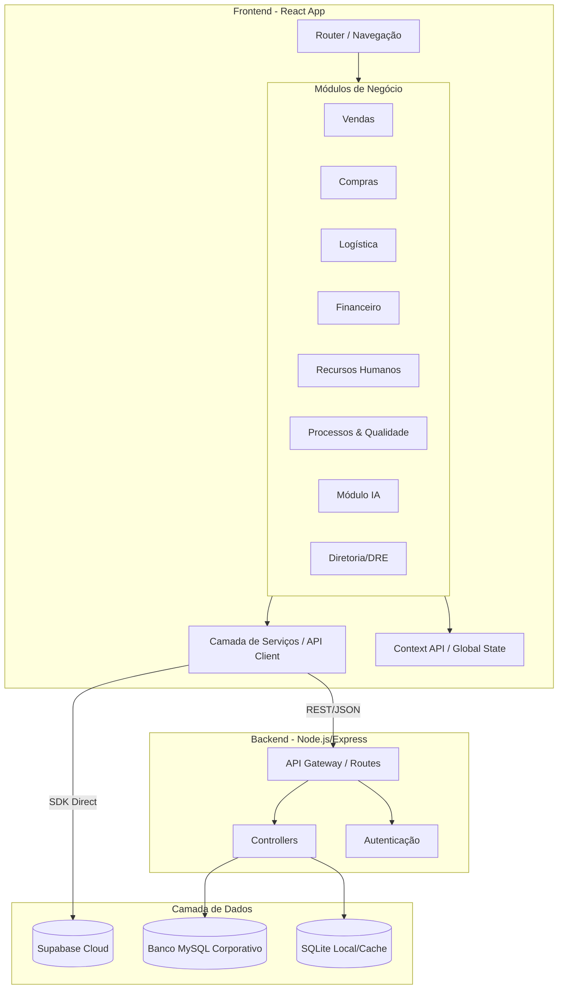

# Estrutura do Projeto e Arquitetura

Este documento descreve a arquitetura atual do sistema "Analise de Dados", detalhando a estrutura de diretórios, a pilha tecnológica e a organização dos módulos de negócio.

## Visão Geral

O projeto é uma aplicação empresarial robusta focada em gestão e análise de dados, composta por:
- **Frontend**: Single Page Application (SPA) complexa com React e Vite, organizada em módulos funcionais (Vendas, Compras, Logística, etc.).
- **Backend**: Servidor API RESTful Node.js com Express para orquestração de dados.
- **Banco de Dados**: Arquitetura híbrida suportando MySQL e SQLite, integrada com serviços em nuvem (Supabase).

## Pilha Tecnológica

### Frontend (Cliente)
- **Core**: React (v18), Vite
- **Navegação**: React Router DOM (v6+) com rotas protegidas
- **UI/UX**: Design customizado (CSS Modules/Styled), Recharts (Dashboards)
- **Gerenciamento de Dados**: Context API, Hooks customizados
- **Integrações**: Supabase Client (Auth/DB), API REST interna

### Backend (Servidor)
- **Runtime**: Node.js
- **API**: Express.js
- **Persistência**: 
  - `mysql2`: Conexão com ERP/Legado
  - `sqlite3`: Cache/Dados locais
  - `dotenv`: Gerenciamento de segredos

## Módulos de Negócio (Frontend)

O sistema é dividido em domínios funcionais para organizar a complexidade:

1.  **Vendas (Sales)**: Análise trimestral, catálogo inteligente, campanhas.
2.  **Compras (Purchases)**: Controle de pedidos, requisições, transferências, gestão de brindes/uniformes.
3.  **Logística**: Gestão de armazém (WMS), treinamentos.
4.  **Financeiro**: Centros de custo, consultas Serasa/SPC, análise de crédito.
5.  **Processos**: Gestão de processos (BPM), documentação, POPs, fluxogramas.
6.  **SAC (Customer Service)**: RNC, assistência técnica, tratativas com fornecedores.
7.  **Inteligência Artificial (AI)**: Agentes de IA, assistentes de vendas.
8.  **Operações**: Gestão de frota, almoxarifado/insumos.
9.  **RH**: Ponto eletrônico, gestão de colaboradores.
10. **Diretoria (Board)**: DRE gerencial, KPIs estratégicos.
11. **TI & Marketing**: Gestão de ativos, ofertas.

## Diagrama de Arquitetura (Mermaid)

O diagrama abaixo detalha a interação entre os módulos do cliente, a camada de serviços e o backend.

